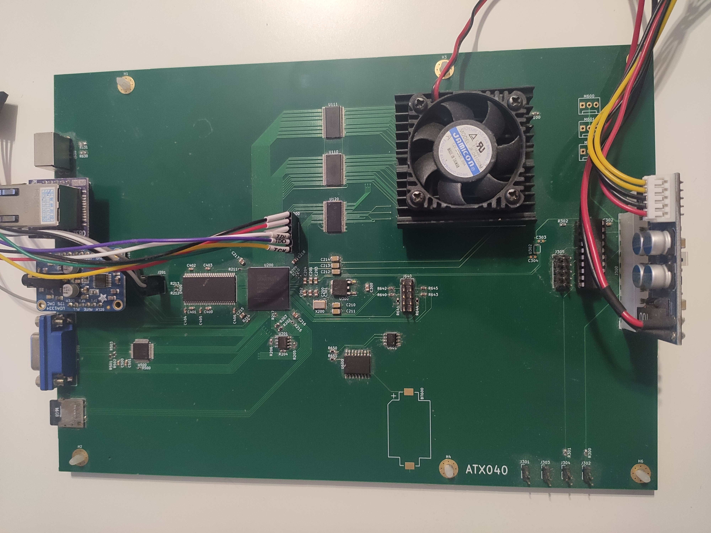

# ATX040

This repository contains hardware design files and sources used with ATX040 single board computer.

The ATX040 SBC contains:

- MC68040 CPU in multiplexed bus configuration
- XC6SLX16 FPGA
- MT48LC16M16 SDRAM
- ADV7123-based VGA output
- SPI Flash
- ENC28J60 ethernet controller
- I2S Audio DAC
- uSD card port
- PS2 keyboard port
- I2C RTC
- I2C EEPROM
